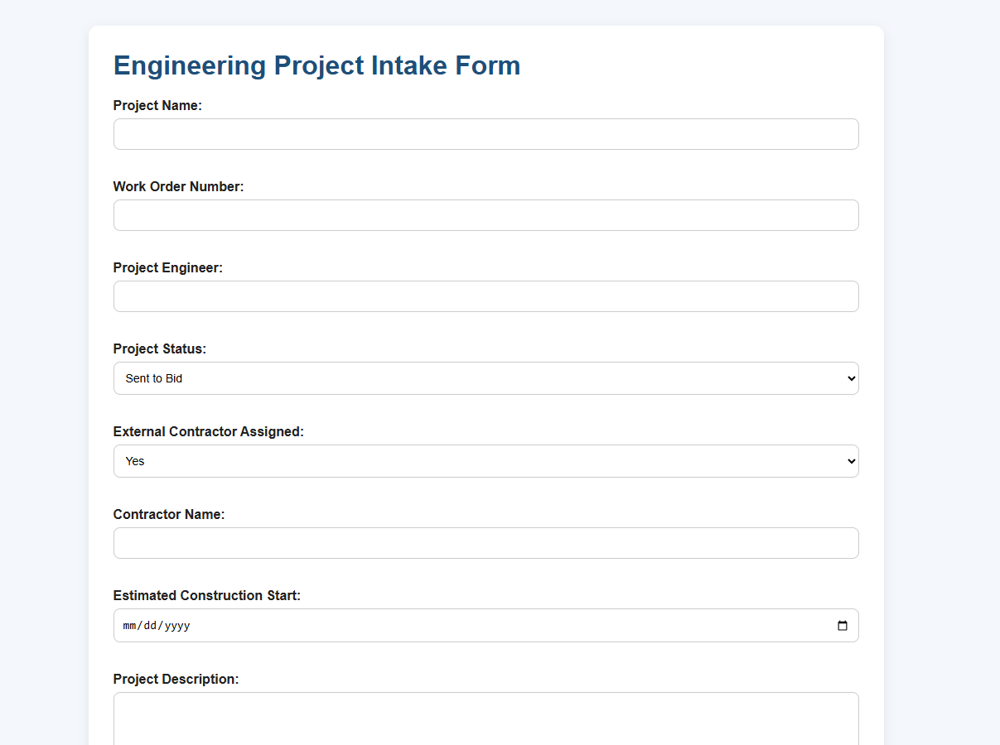
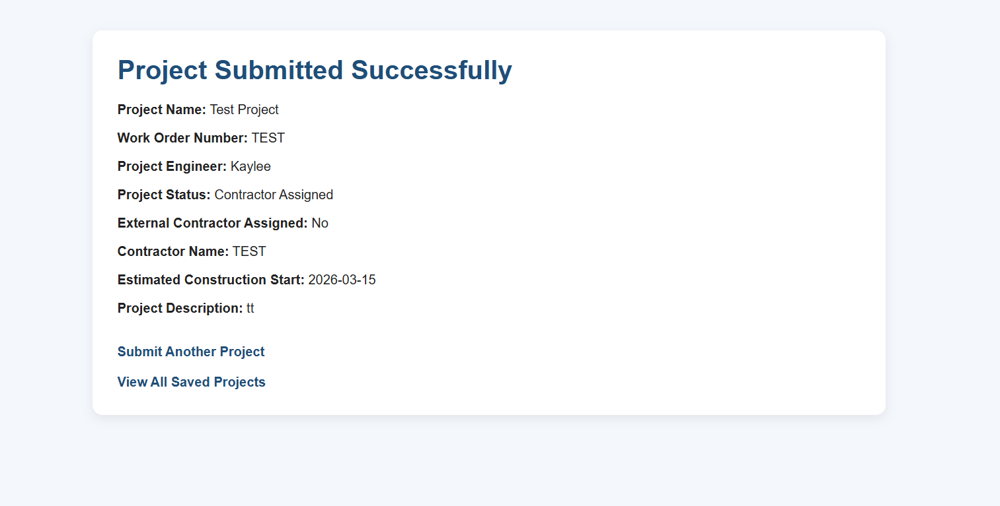
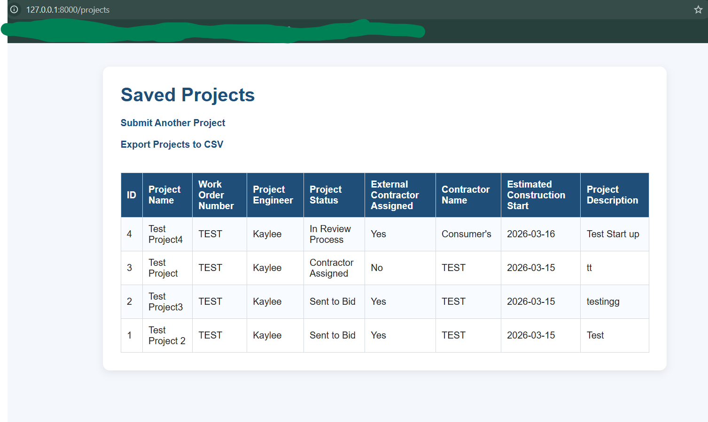

# Engineering Project Intake App

A FastAPI web application for submitting, storing, viewing, and exporting engineering project intake records.

## Application Screenshots

 ### Project Intake Form


### Submission Success Page


### Saved Projects Page


## Features

- Submit new engineering projects through a web form
- Store project records in a SQLite database
- View all saved projects in a table
- Track project status
- Export project data to CSV for reporting and Power BI

## Tech Stack

- Python
- FastAPI
- SQLite
- HTML
- CSS

## Project Structure

```text
engineering-project-intake-app/
│
├── main.py
├── requirements.txt
├── .gitignore
├── static/
│   └── style.css
└── templates/
    ├── form.html
    ├── success.html
    └── projects.html


## How to Run

Clone the repository.

Create a virtual environment.

Activate the virtual environment.

Install dependencies:

pip install -r requirements.txt

Run the app:

uvicorn main:app --reload

Open in browser:

http://127.0.0.1:8000/form

http://127.0.0.1:8000/projects

